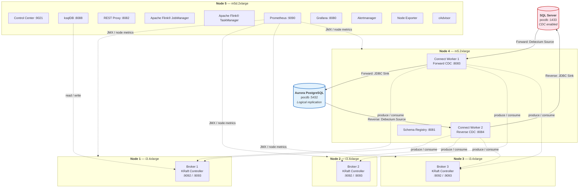

# Confluent Platform on 5-node EC2 on Docker

**Bi-directional Change Data Capture:** SQL Server ↔ Apache Kafka® ↔ Aurora PostgreSQL

Self-managed Confluent Platform 8.x on EC2 with Docker Compose, KRaft mode (no ZooKeeper). Designed for teams evaluating near-real-time bidirectional database sync — covering initial bulk load (~1 TB snapshot), ongoing replication (~300 GB/day), in-flight PII masking, and loop-safe bidirectional writes.

**Deployment time:** ~30-40 minutes | **CDC lag:** ~sub-second | **Snapshot:** ~1 TB | **Ongoing:** ~300 GB/day

---

## Architecture — 5-Node Layout

> ⚠️ **POC/Dev Deployment Only:** This 5-node layout is optimized for evaluation and development. For **production deployments**, follow Confluent Platform co-location rules and isolation best practices. See [**Confluent Platform — Node Co-location Rules & Best Practices**](docs/architecture/colocaton-best-practices.md) for detailed guidance on which components can safely share nodes, hardware sizing per component, and reference architectures for small and large clusters.



<details>
<summary><strong>Infrastructure Requirements</strong></summary>

| Role | vCPU | RAM | Storage | Purpose |
|------|------|-----|---------|---------|
| **Broker** (×3) | 8+ | 32+ GB | 100+ GB NVMe-equiv | Fast sequential I/O for Kafka log writes. NVMe strongly recommended; EBS with IOPS acceptable. |
| **Connect** | 4+ | 16+ GB | 20+ GB | CPU-bound (Java plugins). Runs two Connect workers (forward + reverse paths). |
| **Monitor** | 4+ | 16+ GB | 50+ GB SSD | Local time-series storage for Prometheus. Can use standard SSD or NVMe. |

**Reference sizing (AWS):**
- Brokers: i3.4xlarge (16 vCPU, 122 GB RAM, 2×1.9 TB NVMe) or similar in your cloud
- Connect: m5.2xlarge (8 vCPU, 32 GB RAM) or equivalent
- Monitor: m5d.2xlarge (8 vCPU, 32 GB RAM, 1×300 GB NVMe) or equivalent

**On-premises:** Allocate comparable resources. NVMe or local SSD strongly recommended for brokers.

</details>

### Bi-directional CDC

```
SQL Server ──→ Debezium Source ──→ Kafka Topics ──→ JDBC Sink ──→ Aurora PostgreSQL
                                       ↓
                                    (reverse)
                                       ↓
Aurora PostgreSQL ──→ Debezium Source ──→ Kafka Topics ──→ JDBC Sink ──→ SQL Server
```

---

## Table of Contents

- [Quick Start](#-quick-start--deployment-in-7-phases--helpers)
- [Prerequisites](#prerequisites)
- [Monitoring & Operations](#monitoring--operations)
- [Troubleshooting](#troubleshooting)
- [Documentation](#documentation)
- [Connectors](#connectors)
- [License](#license)

---

## 🚀 Quick Start — Deployment in 7 Phases + Helpers

**Core deployment phases (0-7):** ~30-40 minutes total

| Phase | Script | Purpose | Time |
|-------|--------|---------|------|
| **0** | `./scripts/0-preflight.sh` | Audit infrastructure readiness | 2-3 min |
| **1** | `./scripts/1-validate-env.sh` | Validate .env variables | 1 min |
| **2a** | `./scripts/2a-deploy-repo.sh` | Clone repo to all nodes | 3 min |
| **2b** | `./scripts/2b-distribute-env.sh` | Copy .env to all 5 nodes | 2 min |
| **3** | `./scripts/3-setup-ec2.sh` | Bootstrap EC2 (Docker, NVMe) | 5 min |
| **4** | `./scripts/4-build-connect.sh` | Build custom Connect image | 5-10 min |
| **5** | `./scripts/5-start-node.sh` | Start services on each node | 1-5 min/node |
| **6** | `./scripts/6-deploy-connectors.sh` | Deploy 4 CDC connectors | 2 min |
| **7** | `./scripts/7-validate-poc.sh` | End-to-end CDC validation | 5-10 min |

**Helper scripts (on-demand):**

| Purpose | Script |
|---------|--------|
| **Operational** | `./scripts/ops-health-check.sh` — Verify broker/service health |
| | `./scripts/ops-node-status-ssm.sh` — Check Docker containers on all nodes |
| | `./scripts/ops-stop-node.sh` — Stop services on a specific node |
| **On-Demand** | `./scripts/on-demand-check-prerequisites.sh` — Validate files & directories |
| | `./scripts/on-demand-switch-profile.sh` — Switch between snapshot/streaming tuning |
| **Teardown** | `./scripts/teardown-reset-all-nodes.sh` — Reset nodes for re-deployment |

👉 **[See README-DEPLOYMENT.md](README-DEPLOYMENT.md)** for complete step-by-step workflow

---

## Prerequisites

**Dependency order:** Complete in this sequence:

### 1. Infrastructure Must Be Running

Before starting any deployment script, verify:

- ✅ **5 EC2 instances running** (Brokers 1-3, Connect 4, Monitor 5) — all sized per `Architecture` section above
- ✅ **Aurora PostgreSQL cluster** — accessible from EC2 nodes, empty database ready
- ✅ **SQL Server database** — accessible from EC2 nodes, empty database ready (RDS or on-premises — see note below)
- ✅ **Network connectivity** — EC2 nodes can reach both databases on ports 5432 (Aurora) and 1433 (SQL Server)

> **On-premises SQL Server:** If SQL Server is on-premises rather than RDS, three things change: (1) use `EXEC sys.sp_cdc_enable_db` instead of `msdb.dbo.rds_cdc_enable_db` in the prep script; (2) the orphaned SID issue does not apply — `cdc_reader` can be used for both source and sink connectors; (3) sub-250ms CDC latency is achievable by running `sp_update_jobstep /pollinginterval 0` as `sa` at setup time. Network connectivity from EC2 to on-premises requires AWS Direct Connect or Site-to-Site VPN on port 1433. See [docs/performance/best-practices.md](docs/performance/best-practices.md#on-premises-sql-server) for full details.

**How to verify:**
```bash
# From jumpbox/agent
aws ec2 describe-instances --query 'Reservations[*].Instances[*].[InstanceId,State.Name,PrivateIpAddress]'
```

### 2. Create and Populate `.env` File

This file contains **all credentials, IP addresses, and database connection details**. Deployment scripts load it on every run.

```bash
# Copy template
cp .env.template .env

# Edit .env and fill in all values:
BROKER_1_IP=10.0.1.x           # Private IP of EC2 Node 1
BROKER_2_IP=10.0.1.x           # Private IP of EC2 Node 2
BROKER_3_IP=10.0.1.x           # Private IP of EC2 Node 3
CONNECT_1_IP=10.0.1.x          # Private IP of EC2 Node 4
MONITOR_1_IP=10.0.1.x          # Private IP of EC2 Node 5

AURORA_HOST=mydb.xxxxx.rds.amazonaws.com    # RDS endpoint
AURORA_PORT=5432
AURORA_USER=cdcadmin
AURORA_PASSWORD=<generated-password>
AURORA_DATABASE=pocdb

SQLSERVER_HOST=mydb.xxxxx.rds.amazonaws.com # RDS endpoint or on-premises hostname/IP
SQLSERVER_PORT=1433
SQLSERVER_USER=cdcadmin
SQLSERVER_PASSWORD=<generated-password>
SQLSERVER_DB=pocdb

PUBLIC_REPO_URL=https://github.com/<your-org>/cdc-on-ec2-docker.git
KRAFT_CLUSTER_ID=<generated-id>  # Can be auto-generated; see .env.template for format
# ... fill in all remaining variables from .env.template
```

**Important:** Treat `.env` as secret (contains passwords). Add to `.gitignore` locally; never commit to git.

### 3. Enable CDC on Both Source Databases

**This is customer responsibility** — must be done before Phase 2 (repo deployment). Use database prep scripts from this repo after cloning, or run manually:

**SQL Server** — Enable CDC at database level and per table:

```sql
USE pocdb;
EXEC sys.sp_cdc_enable_db;

-- For each table you want to replicate:
EXEC sys.sp_cdc_enable_table
  @source_schema = N'dbo',
  @source_name   = N'your_table',
  @role_name     = N'cdc_reader',
  @supports_net_changes = 1;
```

**Aurora PostgreSQL** — Enable logical replication:

1. **Modify parameter group** (one-time, requires 5-10 min reboot):
   - In AWS RDS console → Parameter Groups → Create custom parameter group
   - Set `rds.logical_replication = 1`
   - Apply to Aurora cluster (will reboot)

2. **Create replication slot and publication** (run once after reboot):

```sql
-- Connect as superuser (e.g., aurora_user)
SELECT pg_create_logical_replication_slot('debezium_cdc', 'pgoutput');

CREATE PUBLICATION cdc_publication FOR TABLE your_table1, your_table2;
-- Add all tables you want to replicate
```

### 3a. Understand CDC Scope — Schema Migration Is a Separate Workstream

**Critical:** Debezium captures **row-level data changes only**. It does NOT perform target schema migration or manage:

- Indexes (primary, unique, secondary)
- Foreign keys and referential integrity constraints
- Views, stored procedures, triggers, or other DDL objects
- Physical schema design choices (partitioning, compression, encoding, etc.)

**Why this matters:** Treating CDC as a full schema migration framework creates risk:
- Unnecessary write overhead during initial load from creating all source indexes upfront
- Schema design misalignment (source indexes don't necessarily suit target workload)
- Maintenance burden of managing indexes via connectors vs. DBA-reviewed DDL

**Confluent & Kafka best practice:** Separate data movement from schema migration:
- **Use Debezium + Kafka** for reliable, continuous data movement (initial snapshot + streaming changes)
- **Use migration tooling or DBA-managed DDL** for target schema creation and optimization

**Recommended operating model:**

1. **Pre-create essential target schema** before running Phase 5 (Start Brokers):
   - Primary keys on all tables
   - Unique constraints for CDC deduplication
   - Only essential indexes (required for query performance)
   - Data types, nullability, defaults

2. **Run initial snapshot** (Phase 6-7: Deploy & validate connectors) — Debezium captures row data

3. **Validate data consistency** — Confirm all rows migrated and changes flowing

4. **Add secondary indexes and optimization** after data validation completes
   - Prevents write overhead during initial load
   - Allows tuning based on actual target workload query patterns
   - Time-bound so you can measure impact

5. **Add foreign keys and triggers** as final step (after validation)
   - Post-migration constraint validation is easier than maintaining them during load
   - Prevents connector from reapplying constraint violations

**Why sink connectors cannot manage this:** The JDBC Sink connector (which writes Kafka records to PostgreSQL/SQL Server) is designed for **efficient bulk upsert**, not full schema management. It can auto-create basic tables but should not be relied on for:
- Creating indexes during active writes
- Managing referential integrity mid-migration
- Tuning physical design

**Bottom line:** Confluent and Kafka are the **transport layer** for CDC data movement, not the mechanism for migrating schema. Debezium + JDBC sink handle data reliably; database migration tooling and DBA expertise handle schema design.

👉 **For detailed guidance:** See [docs/architecture/schema-migration-model.md](docs/architecture/schema-migration-model.md) — includes implementation checklist, risk analysis, Confluent best practices, and monitoring queries.

### 4. Verify Prerequisites Are Ready

Before running Phase 0, check:

```bash
# 1. .env file exists and is readable
test -f .env && echo "✅ .env found" || echo "❌ .env missing"

# 2. All EC2 instances are reachable (will be verified by Phase 0 script)
# 3. Both databases have CDC enabled (customer responsibility — verify manually)
```

Once all 4 steps are complete, proceed to [README-DEPLOYMENT.md](README-DEPLOYMENT.md) and run Phase 0.

---

## Monitoring & Operations

### Operational Commands

```bash
./scripts/ops-health-check.sh              # Local checks
./scripts/ops-health-check.sh --remote <ip>  # Remote node checks
./scripts/ops-node-status-ssm.sh           # Docker status on all nodes (auto-loads from .env)
./scripts/ops-stop-node.sh broker1         # Stop services on a node
```

### Access Points

- **Grafana:** `http://localhost:8080` (via SSM port forward to Node 5)
- **Control Center:** `http://localhost:9021`
- **ksqlDB:** `http://localhost:8088`
- **Connect REST:** `http://localhost:8083`
- **Schema Registry:** `http://localhost:8081`
- **Prometheus:** `http://localhost:9090`

### On-Demand Tasks

```bash
./scripts/on-demand-check-prerequisites.sh # Validate files & directories
./scripts/on-demand-switch-profile.sh streaming  # Switch tuning profiles
```

### Teardown

```bash
./scripts/teardown-reset-all-nodes.sh      # Reset nodes for re-deployment
```

---

## Troubleshooting

| Issue | Check |
|-------|-------|
| Phase 0 fails: "Cannot find instance" | EC2 instances running? Correct IPs in .env? |
| Phase 2 fails: "git not found" | `scripts/2b-deploy-repo.sh` should auto-install git |
| Phase 3 fails: "This script must be run as root" | Use `sudo` when running on node directly |
| Phase 4 timeout: Build hangs | Check Node 4 docker logs: `docker logs <image>` |
| Phase 6 fails: "Connect not responding" | Verify `5-start-node.sh connect` completed and is running |
| Phase 7 fails: "No data in Aurora" | Check connector status: `curl http://localhost:8083/connectors/<name>/status` |

See [docs/operations/troubleshooting.md](docs/operations/troubleshooting.md) for detailed troubleshooting.

---

## Documentation

- **[README-DEPLOYMENT.md](README-DEPLOYMENT.md)** ← Start here! Complete step-by-step workflow
- **[docs/README.md](docs/README.md)** — Documentation index and TOC
- **[docs/architecture/schema-migration-model.md](docs/architecture/schema-migration-model.md)** — CDC scope, schema migration strategy, and implementation checklist (Confluent & Kafka best practices)
- **[docs/architecture/topology.md](docs/architecture/topology.md)** — Node roles and service layout
- **[docs/operations/troubleshooting.md](docs/operations/troubleshooting.md)** — Deep troubleshooting guide
- **[docs/operations/dlq.md](docs/operations/dlq.md)** — Dead Letter Queue operations and replay
- **[docs/operations/startup.md](docs/operations/startup.md)** — Expected startup durations per service
- **[docs/performance/best-practices.md](docs/performance/best-practices.md)** — Performance tuning for snapshot and streaming
- **[docs/performance/profiles.md](docs/performance/profiles.md)** — Snapshot vs. streaming profile switching
- **[docs/reference/cheat-sheet.md](docs/reference/cheat-sheet.md)** — Common commands at a glance

---

## Connectors

Four Debezium + JDBC connectors for bi-directional CDC:

1. **debezium-sqlserver-source** — SQL Server → Kafka
2. **jdbc-sink-aurora** — Kafka → Aurora PostgreSQL
3. **debezium-postgres-source** — Aurora PostgreSQL → Kafka
4. **jdbc-sink-sqlserver** — Kafka → SQL Server

All use SMT transforms, at-least-once delivery, and Dead Letter Queues.

---

## Support

- Check [docs/operations/troubleshooting.md](docs/operations/troubleshooting.md) first
- Review [docs/reference/cheat-sheet.md](docs/reference/cheat-sheet.md) for common commands
- See phase-specific logs: `docker logs <service>`

---

## License

Licensed under the Apache License, Version 2.0. See [LICENSE](LICENSE) for details.

> **POC / demo use only.** This deployment uses PLAINTEXT listeners and has no TLS, RBAC, or ACLs configured. Before using in a production environment, enable TLS encryption, configure Confluent RBAC or Kafka ACLs, and engage Confluent Professional Services for architecture review.

---

*Apache, Apache Kafka, Kafka, and the Kafka logo are trademarks of The Apache Software Foundation. Apache Flink and Flink are trademarks of The Apache Software Foundation.*
