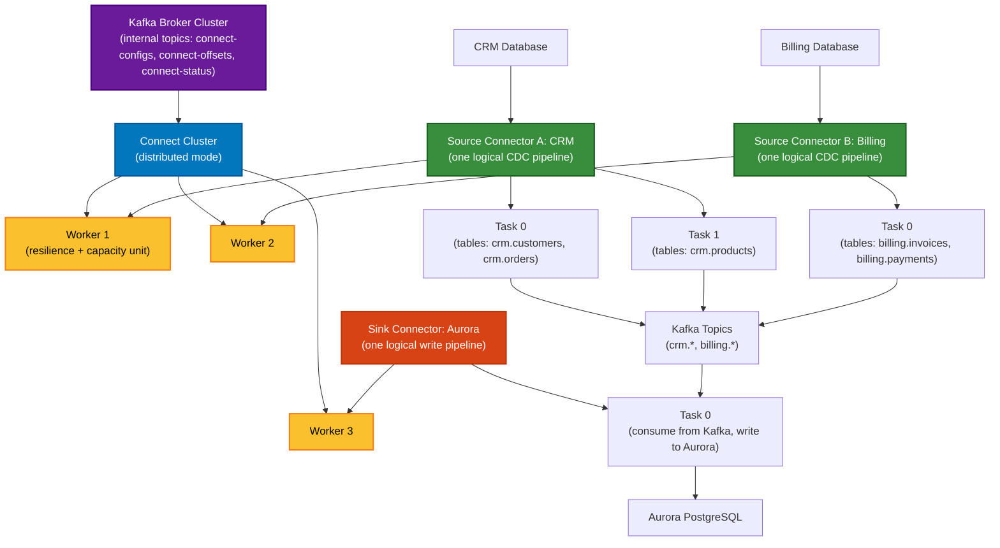

# Kafka Connect at Scale: Best Practices

Design Kafka Connect as a **platform** for **100s of databases** and **1000s of tables**, optimizing for isolation, scalability, failure containment, and operational simplicity.

---

## 1. Use distributed mode for production

**Distributed mode** provides multiple workers, shared state in Kafka, task redistribution on failure, and fault tolerance.

Use **standalone mode** only for development and testing.

**Internal topics** (`connect-configs`, `connect-offsets`, `connect-status`) must be durable (RF=3) and available across failure domains.

**Delivery**: Kafka Connect provides at-least-once semantics. Sink targets should support idempotency or deduplication.

---

## 2. Segment by isolation boundary

At scale, separate **Connect clusters** by:
- **environment** (prod / non-prod)
- **region** or **network boundary**
- **database technology** or **business domain**
- **SLA** or **operational ownership**

**Operating model**: One Kafka cluster per Connect cluster. Do not use Connect as a bridge between multiple Kafka clusters.

---

## 3. Use connectors as the horizontal scaling unit

Prefer **multiple connectors** over one large connector.

Good boundaries:
- **one database per connector** (or one schema / domain)
- **isolated connectors for largest or noisiest sources**

Benefits:
- blast-radius isolation
- easier troubleshooting
- targeted scaling
- safer upgrades

Avoid one connector spanning many unrelated databases or too many critical tables.

---

## 4. Understand workers vs tasks

- **Workers** = cluster resilience and capacity
- **Tasks** = connector parallelism

Add **workers** when CPU, memory, or network is constrained.

Add **tasks** only when the connector and source system support real parallelism (tables, partitions, external resources).

**Sizing heuristic** (starting point only):
- ~2 tasks per core, ~8 tasks per worker
- validate against connector memory profile, message size, throughput, transformations, and source/sink latency

Do not assume `tasks.max` increases always improve throughput. Measure a **single optimized task**, then scale from there.

---

## 5. Isolate high-volume and noisy workloads

Create dedicated clusters for:
- largest databases
- high-churn CDC sources
- large snapshot workloads
- strict-latency pipelines
- business-critical domains

This prevents snapshot spikes, rebalances, and anomalies from destabilizing shared estates.

---

## 6. Separate prod and non-prod

Keep production and non-production isolated.

Use non-prod for validation, testing, schema checks, and operational rehearsal.

---

## 7. HA and failure domains

Production design:
- **3+ workers** in distributed mode
- workers spread across **failure domains**
- internal topics replicated for durability

For Kubernetes (CFK):
- spread pods across **availability zones**
- use **topology spread constraints** and **pod anti-affinity**

On worker failure, tasks rebalance to surviving workers and resume from committed offsets (expect temporary rebalance cost).

---

## 8. DR: manual failover

Kafka Connect does **not** provide automatic cross-cluster failover.

DR pattern:
- one Connect cluster per Kafka cluster (primary + DR)
- equivalent connector definitions in both regions
- only one active at a time

Failover requires operational procedures and explicit connector lifecycle management.

---

## Appendix: Connector-to-Worker-to-Task Hierarchy

**Key insights:**
- **Workers** are the resilience and capacity unit; add workers when CPU/memory/network is constrained
- **Connectors** are the scaling and isolation unit; use multiple connectors per database/domain boundary
- **Tasks** are parallelism within a connector; add tasks only when connector and source system support real parallelism (e.g., multiple tables, partitions)
- One worker failure triggers task rebalance across surviving workers
- All workers coordinate via shared Kafka state (internal topics)
