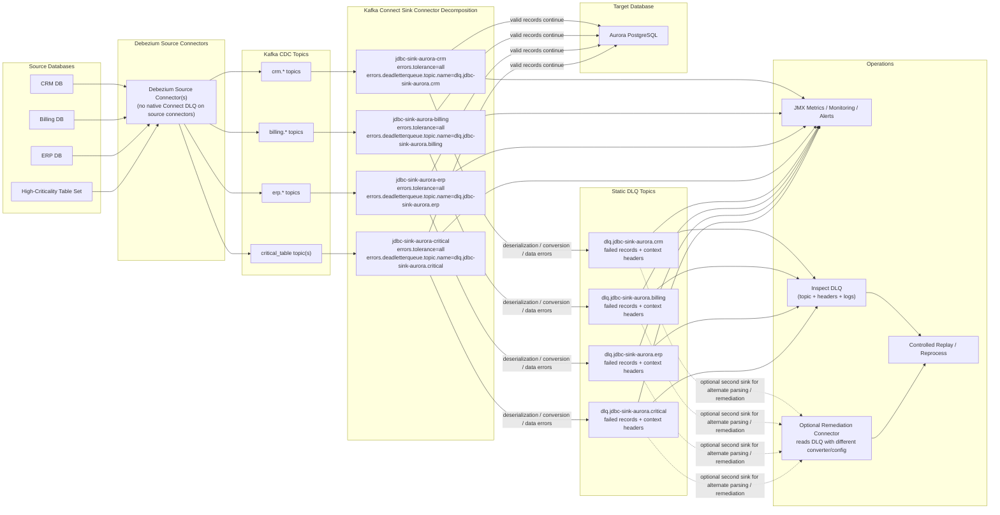

# DLQ Operations

Dead Letter Queue (DLQ) design and operations for Kafka Connect sink connectors.

## Summary

Kafka Connect supports a single static DLQ topic per sink connector, so DLQ design is really a connector design question rather than a per-record routing question.

The best practice is to start with one DLQ per sink connector and group sink connectors by database, domain, or application boundary. This keeps the design operationally simple and avoids creating an unmanageable number of DLQ topics in large CDC environments.

If stronger isolation is needed, split connectors only when there is a clear reason such as separate ownership, different SLA, compliance requirements, or the need for isolated replay. A per-topic DLQ is usually an exception for high-value or high-risk flows, not the default design.

It is also important to note that Kafka Connect provides DLQ support for sink connectors only. There is no native Kafka Connect DLQ for source connectors.

## Best-Practice Policies

### Use one DLQ per sink connector as the default pattern

Each sink connector gets its own DLQ topic:

| Connector | DLQ Topic |
|-----------|-----------|
| `jdbc-sink-aurora` | `dlq-jdbc-sink-aurora` |
| `jdbc-sink-sqlserver` | `dlq-jdbc-sink-sqlserver` |

Never share a DLQ topic between connectors. Separate topics allow independent monitoring, alerting, and replay per pipeline path.

### Group sink connectors by database, domain, or application boundary

For large deployments with many connectors, organize by logical unit (e.g., all finance-domain sinks share monitoring, all customer-domain sinks share monitoring) to keep the design operationally simple.

### Avoid one connector per table unless there is a strong operational reason

Start with one sink connector per database boundary (e.g., one Aurora sink, one SQL Server sink). Split only when isolation is critical.

### Split connectors only for:

- **Isolated replay needs** — some data requires fast retry, others can wait
- **Separate team ownership** — different teams own different pipelines
- **Different SLA or compliance boundaries** — some tables have stricter requirements
- **Noisy failure domains that need isolation** — one table with frequent violations shouldn't block others

### Enable DLQ with:

```json
{
  "errors.tolerance": "all",
  "errors.deadletterqueue.topic.name": "dlq-<connector-name>",
  "errors.deadletterqueue.topic.replication.factor": "3",
  "errors.deadletterqueue.context.headers.enable": "true",
  "errors.log.enable": "true",
  "errors.log.include.messages": "true"
}
```

| Property | Value | Purpose |
|----------|-------|---------|
| `errors.tolerance` | `all` | Continue processing on errors instead of failing the task |
| `errors.deadletterqueue.topic.name` | `dlq-<connector-name>` | DLQ topic for this connector |
| `errors.deadletterqueue.topic.replication.factor` | `3` | Match cluster RF for durability |
| `errors.deadletterqueue.context.headers.enable` | `true` | Attach error context as Kafka headers |
| `errors.log.enable` | `true` | Log errors to Connect worker log |
| `errors.log.include.messages` | `true` | Include the failing record in the log |

### Add monitoring, alerting, and logging so DLQ activity is visible

Treat the DLQ as an operational triage and remediation stream. Set up Grafana panels and Prometheus alerts to catch DLQ growth early.

### Treat the DLQ as an operational triage and remediation stream, not a silent discard path

Every DLQ record is a signal that something went wrong. Investigate, fix the root cause, and replay only when appropriate.

### Keep replay controlled and explicit

Do not automatically replay DLQ messages. Replay is a deliberate operational decision that should require explicit approval and validation.

## Short FAQ

**Q: Does Kafka Connect support DLQ?**
Yes, for sink connectors. A sink connector can write failed records to a single configured DLQ topic.

**Q: Is there a native DLQ for source connectors?**
No. Kafka Connect does not provide a native DLQ for source connectors.

**Q: How should customers design DLQ at scale?**
Start with one DLQ per sink connector and group connectors by database, domain, or application boundary.

**Q: When should a connector be split?**
Only when you need isolated replay, separate ownership, different SLA, or compliance isolation.

**Q: Is there a built-in DLQ replay feature?**
Not as a one-click Kafka Connect feature. Since the DLQ is just a Kafka topic, replay is usually implemented with a second connector, a custom remediation flow, or a controlled republish/reprocess process.

**Q: What should operators do with DLQ records?**
Use headers, logs, and monitoring to inspect failures, fix the root cause, and replay only when appropriate.

## Common DLQ Scenarios

### Type Mismatch

**Symptom:** Records in DLQ with `exception.message` containing "Cannot convert" or type-related errors.

**Cause:** Source schema has a type that doesn't map cleanly to the target database (e.g., SQL Server `MONEY` to PostgreSQL `NUMERIC`, or vice versa).

**Fix:** Add `Cast` or `ReplaceField` SMTs to the source or sink connector to coerce types before they reach the target database.

### Null Primary Key

**Symptom:** DLQ records with "null value for non-null column" or "primary key must not be null."

**Cause:** Table has a PK in the target but the source record has NULL key fields. Common with no-PK tables or when `pk.mode` is misconfigured.

**Fix:** Use `ValueToKey` SMT to construct a composite key from non-null value fields, or set `pk.mode=record_value` with `pk.fields` specifying the columns.

### Schema Incompatibility

**Symptom:** `VALUE_CONVERTER` stage errors, often Avro or JSON Schema deserialization failures.

**Cause:** Schema evolution broke compatibility (e.g., a non-optional field was removed, or a field type changed in a backward-incompatible way).

**Fix:** Check Schema Registry compatibility settings. Register a compatible schema version or set compatibility to `NONE` temporarily (not recommended for production).

```bash
# Check subject compatibility
curl http://${BROKER_1_IP}:8081/config/${SQLSERVER_TOPIC_PREFIX}.${DB}.${SCHEMA}.${TABLE}-value

# List schema versions
curl http://${BROKER_1_IP}:8081/subjects/${SQLSERVER_TOPIC_PREFIX}.${DB}.${SCHEMA}.${TABLE}-value/versions
```

### Constraint Violation

**Symptom:** DLQ records with "duplicate key" or "unique constraint" errors.

**Cause:** Upsert mode is not enabled, or the target table has constraints that conflict with the incoming data.

**Fix:** Ensure `insert.mode=upsert` on the JDBC sink. If the target has unique constraints beyond the PK, those need to be handled (drop the constraint or add `ReplaceField` SMT to exclude the conflicting column).

### Connection Errors

**Symptom:** DLQ records with "connection refused" or "timeout" errors.

**Cause:** Target database is unreachable. This is transient -- the connector retries, but if retries are exhausted, the record goes to DLQ.

**Fix:** Check network connectivity, security groups, and database availability. These records are safe to replay once the connection is restored.

## Replaying DLQ Messages

### Manual Replay with kcat

Produce DLQ messages back to the original topic:

```bash
# Read from DLQ and produce to the original source topic
kcat -C -b ${BROKER_1_IP}:9092 -t dlq-jdbc-sink-aurora -o beginning -e | \
  kcat -P -b ${BROKER_1_IP}:9092 -t ${SQLSERVER_TOPIC_PREFIX}.${DB}.${SCHEMA}.${TABLE}
```

**Caution:** This replays ALL DLQ messages. If the root cause is not fixed, they will land in the DLQ again.

### Selective Replay

For targeted replay, consume DLQ messages, filter, and produce:

```bash
# Read DLQ messages to a file for inspection
kcat -C -b ${BROKER_1_IP}:9092 -t dlq-jdbc-sink-aurora -o beginning -e \
  -f '%k|%s\n' > /tmp/dlq-messages.txt

# Inspect and edit /tmp/dlq-messages.txt, then replay selected records
# (pipe through kcat -P with appropriate key/value separator)
```

### Replay with Connect

Create a temporary source connector that reads from the DLQ topic and writes to the target:

```json
{
  "name": "replay-dlq-aurora",
  "config": {
    "connector.class": "io.debezium.connector.jdbc.JdbcSinkConnector",
    "topics": "dlq-jdbc-sink-aurora",
    "connection.url": "jdbc:postgresql://${AURORA_HOST}:${AURORA_PORT}/${AURORA_DATABASE}",
    "connection.username": "${AURORA_USER}",
    "connection.password": "${AURORA_PASSWORD}",
    "insert.mode": "upsert",
    "primary.key.mode": "record_key",
    "schema.evolution": "none",
    "tasks.max": "1"
  }
}
```

Delete this connector after replay is complete.

## Clearing a DLQ Topic

### Option 1: Delete and Recreate

```bash
# Delete the topic
kafka-topics --bootstrap-server ${BROKER_1_IP}:9092 \
  --delete --topic dlq-jdbc-sink-aurora

# It will be auto-created when the next error occurs (if auto.create.topics=true)
# Or recreate manually:
kafka-topics --bootstrap-server ${BROKER_1_IP}:9092 \
  --create --topic dlq-jdbc-sink-aurora \
  --partitions 1 --replication-factor 3
```

### Option 2: Set Short Retention Temporarily

```bash
# Set 1-second retention to purge messages
kafka-configs --bootstrap-server ${BROKER_1_IP}:9092 \
  --alter --entity-type topics --entity-name dlq-jdbc-sink-aurora \
  --add-config retention.ms=1000

# Wait a few seconds for cleanup, then restore retention
kafka-configs --bootstrap-server ${BROKER_1_IP}:9092 \
  --alter --entity-type topics --entity-name dlq-jdbc-sink-aurora \
  --delete-config retention.ms
```

## Monitoring DLQs with Grafana

### Key Metrics

| Metric | What It Means |
|--------|---------------|
| `kafka_server_BrokerTopicMetrics_MessagesInPerSec` (filtered by DLQ topic) | Rate of errors being sent to DLQ |
| `kafka_log_Log_Size` (filtered by DLQ topic) | Total DLQ size on disk |
| Consumer group lag on DLQ topic | Unprocessed DLQ messages (if you have a DLQ consumer) |

### Alerting Rules

Add to Prometheus `alert-rules.yml`:

```yaml
groups:
  - name: dlq-alerts
    rules:
      - alert: DLQMessagesProduced
        expr: sum(rate(kafka_server_BrokerTopicMetrics_MessagesInPerSec{topic=~"dlq-.*"}[5m])) > 0
        for: 1m
        labels:
          severity: warning
        annotations:
          summary: "DLQ is receiving messages"
          description: "Dead letter queue {{ $labels.topic }} has received messages in the last 5 minutes. Investigate connector errors."

      - alert: DLQBacklogGrowing
        expr: kafka_log_Log_Size{topic=~"dlq-.*"} > 10485760
        for: 5m
        labels:
          severity: critical
        annotations:
          summary: "DLQ backlog exceeds 10 MB"
          description: "Dead letter queue {{ $labels.topic }} has grown beyond 10 MB. Records are accumulating and need attention."
```

### DLQ Grafana Panel

Add a panel to the Connect CDC dashboard:

- **Query:** `sum by (topic) (kafka_log_Log_Size{topic=~"dlq-.*"})`
- **Visualization:** Stat or time series
- **Threshold:** Green < 0, Yellow > 0, Red > 10 MB

A healthy system has zero DLQ messages. Any DLQ activity warrants investigation.

## Appendix: Sample DLQ Setup



---

*Apache, Apache Kafka, Kafka, and the Kafka logo are trademarks of The Apache Software Foundation.*
